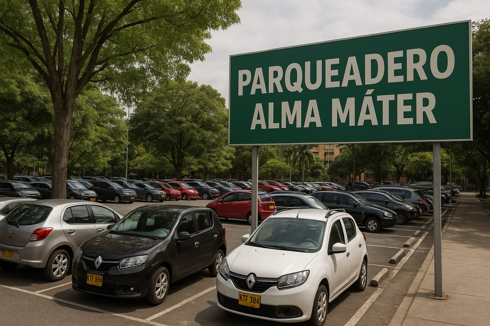
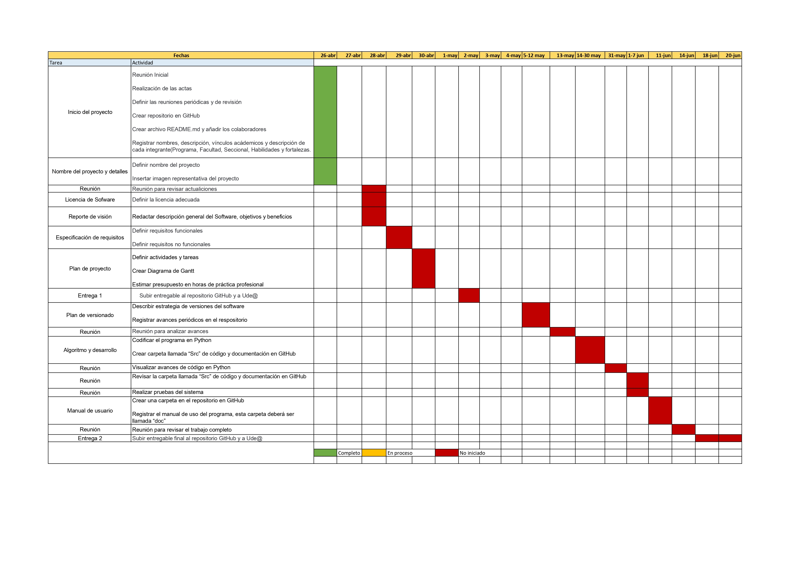

# Trabajo Final Algoritmia y Programación 2025-1
## Integrantes
- Aida Andrea Arredondo Silva
- Natalia Restrepo Calvo
- Paola López
 

## Descripción
Este proyecto consiste en el desarrollo de un programa de consola en Python para gestionar el parqueadero(Nombre) que presta servicio exclusivvamente a automóviles en el sector de la Universidad de Antioquia. El software permitirá registrar usuarios, ingresar y retirar vehículos, generar cobros, facturas básicas, resportes administrativos y exportar la información a archivos CSV.

## Vínculos académicos y descripción

### Aida Arredondo

**Programa:** Ingeniería Industrial, Facultad de Ingeniería

**Seccional**: Occidente

**Habilidades y Fortalezas:** Me considero una persona creativa, con buen sentido del diseño y con disposición a explorar y aprender cosas nuevas. Me gusta encontrar soluciones prácticas a los problemas y trabajar en equipo. Soy responsable, curiosa, me adapto fácilmente a los cambios y siempre busco mejorar en cada proyecto en el que participo.

### Natalia Restrepo Calvo

**Programa** Ingeniería Industrial, Facultad de Ingeniería 

**Seccional**: Urabá - Turbo

**Habilidades y Fortalezas:** Me considero una persona responsable, respetuosa y con capacidad para el trabajo en equipo. Me adapto con facilidad a nuevos entornos y aprendo facilmente. Busco mejorar y aportar lo mejor de mí en cada actividad.  

### Dania Paola Lòpez Torres

**Programa** Ingeniería Industrial, Facultad de Ingeniería

**Seccional**: Norte - Yarumal

**Habilidades y Fortalezas:** Me considero una persona tranquila, empàtica y responsable, con capacidad de trabajar en equipo y actitud colaborativa. Busco superar cada una de mis metas personales y profesionales, manteniendo una actitud de mejora continua. 

# Parqueadero Alma Máter 
Espacio exclusivo para el estacionamiento de automóviles de la comunidad universitaria de la Universidad de Antioquia. Actualemente, el proceso es manual y necesita un sistema en Python para gestionar usuarios, controlar entradas y salidas, generar cobros y emitir reportes. El parqueadero opera de 06:00 am a 12:00 pm con tres empleados en turnos de 6 horas. 

# Licencia de Software
La liecencia recomendada para el software es **Creative Commons Atribución 4.0 Internacional**
Esta licencia exige que los reutilizadores den crédito al creador. Permite distribuir, remezclar, adaptar y desarrollar el material en cualquier medio o formato, incluso con fines comerciales.

Con esta liencia se tiene libertad para:
Compartir: copiar y redistribuir el material en cualquier medio o formato para cualquier propósito, incluso comercial.
Adaptar: remezclar, transformar y desarrollar el material para cualquier propósito, incluso comercial.
El licenciante no puede revocar estas libertades siempre que cumpla con los términos de la licencia.
Bajo los siguientes términos:
Atribución: debe otorgar el crédito correspondiente, proporcionar un enlace a la licencia e indicar si se realizaron cambios. Puede hacerlo de cualquier manera razonable, pero no de ninguna manera que sugiera que el licenciante lo respalda a usted o a su uso.
Sin restricciones adicionales: no puede aplicar términos legales ni medidas tecnológicas que restrinjan legalmente a otros hacer lo que permite la licencia.
Avisos:
No tiene que cumplir con la licencia para elementos del material de dominio público o cuando su uso esté permitido por una excepción o limitación aplicable.

No se ofrecen garantías. Es posible que la licencia no le otorgue todos los permisos necesarios para el uso previsto. Por ejemplo, otros derechos como la publicidad, la privacidad o los derechos morales pueden limitar el modo en que utiliza el material.

## Reporte de visiòn: Software de gestiòn para el parqueadero Alma Màter
**Descripciòn general del sofware:** 

El sofware de gstiòn para el parqueadero Alma Màter serà una aplicaciòn de consola desarrollada en Python, diseñada para automatizar y optimizar las opraciones diarias dl parqueader. Su interfaz sera intuitiva y de fàcil uso para el personal, permitièndoles gestionar eficientemente el ingreso y salida de vehìculos, el registro de usuarios, la generaciòn de cobros y facturas, y la creaciòn de reportes administrativos.

### **Objetivos:**
El objetivo principa de este software es modernizar la gestión del parqueadero, pasando de un sistema manual a uno digitalizado. Esto se logrará mediante las siguientes funcionalidades clave:

**Registros de Usuarios:** Permitir el registro de usuarios frecuentes o visistantes, almacenando información revelante como placa del vehículo y datos de contacto (opcional).

**Gestión de ingreso y salidas de vehículos:** Facilitar el registro de la hora y la fecha d eingreso de cada automóvil al parqueadero, así como la asignación del espacio de parqueo seleccionado. De igual manera, registrar la hora y fecha de sañlida del vehículo. 

**Cálculo automático de cobros:** Implementar un sistema de cálculo automátixo del valor a oagar por el tiempo de estacionamiento, considerando tarifas por hora y fracción. 

**Generación de facturas:** Crear la funcinalidad para generar facturas digitales para los usuarios que lo requieran, detallando el tiempo de estacionamiento y el valor pagado. 

**Generación de reportes administrativos:** Producir reportes periódicos que permitan al administrador del parqueadero tener una visión clara de la ocupación, los ingresos generados, el flujo de vehículos, y otros datos relevantes para la toma de decisiones. 

**Interfaz de consola amigable:** Desarrollar una interfaz de línea de comandos en Python que sea visualmente organizada y fácil de navegar para los operarios del parqueadero.

**Exportación de datos:** Permitir la exportación de los datos generados (registros, cobros, etc.) a un archivo plano en formato CSV para su posterior análisis o almacenamiento.

### **Beneficios:**
La implementación de este software de gestión traerá consigo una serie de beneficios significativos para el parqueadero Alma Máter, los cuales son:

**Mayor eficiencia operativa:** La automatización de tareas como el registro de ingresos y salidas, y el cálculo de cobros, reducirá el tiempo dedicado a esta actividades manuales, permitiendo al personal enfocarse en brindar un mejor servicio al cliente. 

**Reducción de errores:** Eliminar el registro manual en papel minimizará los errores humanos asociados a la transcripción de datos y al cálculo de tarifas.

**Mejor control de ingresos:** El sistema registrará de manera precisa todos los ingresos generados, facilitando la gestión financiera y la detección de posibles inconsistencias.

**Información para la toma de decisiones:** Los reportes administrativos proporcionarán datos valiosos sobre la ocupación del parqueadero, los horarios de mayor demanda, y otros indicadores clave que ayudarán a optimizar la operación y la planificación futura.

## Diagrama de Gantt Chart

